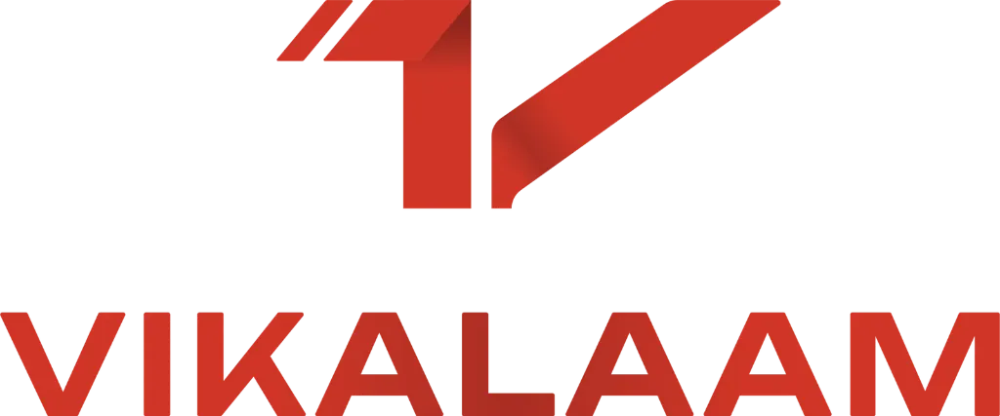

# VIKALAAM — AI-Powered Used-Bike Acquisition Operating System & CRM

<div align="center">
  
  <p><strong>Next-Generation Used-Bike Acquisition, Valuation, Sales & Employee Operations CRM</strong></p>
</div>

---

## Overview

**VIKALAAM** is an AI-powered vehicle acquisition operating system that transforms traditional used-bike CRM workflows into a single connected intelligence layer. It seamlessly unifies omnichannel customer intake, dynamic qualification, algorithmic valuation with strict price guardrails, 13-point field inspections, manager approval workflows, employee workload balancing, and closed-loop marketing reactivation.

---

## Key Features

- **15-Stage Finite State Machine**: Strict pipeline enforcing domain rules from `01_NEW_LEAD` through `14_PURCHASED` and `15_INVENTORY`.
- **"Park is not Lost" Lifecycle Engine**: Dedicated sub-queues (`NEW_LEAD_PARK`, `DETAILS_PARK`, `QUOTE_PARK`, `NEGOTIATION_PARK`, `INSPECTION_PARK`) with automated 7-day reactivation and instant context restoration.
- **Guardrailed Valuation Engine**: Algorithmic market baseline valuation with a 4-tier Authority Matrix preventing AI hallucination of price quotes.
- **Omnichannel Conversational AI Swarm**: Role-isolated autonomous agents (Intake, Qualification, Documents, Photos, Sales/Negotiation, Inspection, Reactivation).
- **Lead Command Center (`/leads/[id]`)**: Real-time 3-column workspace with Customer 360, Vehicle 360, live WhatsApp stream, and AI Employee Copilot.
- **Mobile-First Inspector PWA (`/inspector`)**: 13-point mechanical inspection checklist, defect scoring, and purchase recommendation engine.
- **Management Intelligence (`/analytics`)**: Natural-language Manager AI Copilot (*"Why are we losing leads?"*), full funnel analytics, and gross resale margins.
- **Employee OS & Workload Engine (`/employees`)**: Dynamic multi-factor assignment (Location + Language + Skills + Availability - Active Load).
- **Closed-Loop Marketing CRM (`/marketing`)**: Segment-based WhatsApp broadcasts with direct attribution to net resale profit.

---

## Tech Stack

- **Framework**: Next.js 14 (App Router), React 18, TypeScript
- **Styling**: Tailwind CSS, Lucide Icons, Framer Motion
- **Architecture**: Domain-Driven Design (DDD), Finite State Machine, Event-Driven Agent Orchestration

---

## Getting Started

### 1. Install Dependencies
```bash
npm install
```

### 2. Run the Development Server
```bash
npm run dev
```

Open [http://localhost:3000](http://localhost:3000) in your browser.

### 3. Build for Production
```bash
npm run build
npm run start
```
